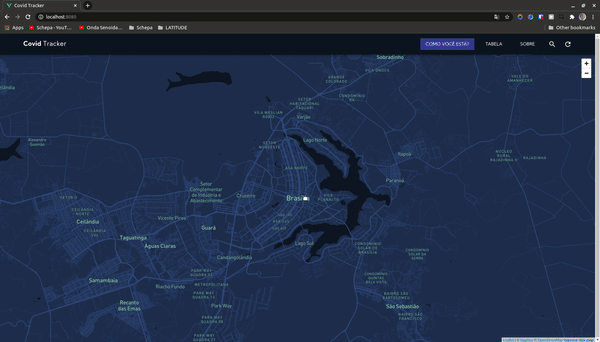

# Covid Tracker

Essa ideia é motivada pelo [Desafio](https://gitlab.com/GuiFay/selecao-latitude/-/blob/master/README.md) do Laboratório [LATITUTE](https://redes.unb.br/latitude/index.html) da Universidade de Brasília.

## Proposta

Covid Tracker é uma proposta de site que colete informações diárias sobre a saúde das pessoas com o objetivo de mostrar, através de um mapa, casos de COVID-19 próximos.
### Tecnologia

Uma aplicação _SPA_ em **Vue.js** que consome uma _API_ em **Node.js** e guarda as informações em um banco de dados em **PostgreSQL**.

### Estado atual

<p align="center">
  
</p>


## Configurações Iniciais

```
npm install
```

### Compilação e _hot-reload_ para desenvolvimento

```
npm run serve
```

### Compilação e redução de tamanho para produção

```
npm run build
```

### Análise estática

```
npm run lint
```

### Outras configurações

Ver [Configurações Vue.js](https://cli.vuejs.org/config/).
